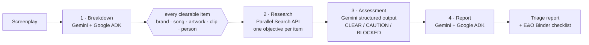

# 🎬 ClearanceRoom

**Every frame cleared.** A deterministic, multi-step clearance agent for film & TV scripts — built on **Gemini (Vertex AI) + Google ADK**, with the **Parallel Search API** as its research engine.

> Before any script shoots, every brand, real person, song, artwork, clip, and location must be cleared for legal risk — a **script clearance report** that runs **$1,000–$3,000 and 5–10 business days** by hand. ClearanceRoom is the fast pre-production **triage** that runs *first*: in about a minute it surfaces the landmines with live web evidence and a concrete fix, so counsel's time goes to the handful of items that actually matter. It's not a substitute for that report — or for entertainment counsel.

Built for the **Agentic Cinema** hackathon — **Parallel track**.

**🔴 Live demo: https://clearanceroom-957638696965.us-central1.run.app** — hosted on Cloud Run, running the full live pipeline (Gemini 3.6 Flash on Vertex AI + Parallel Search). Hit **RUN CLEARANCE** and watch it tear the sample script apart in about a minute.

## Three agents and a binder, one war room

**🎬 Script Clearance** — the flagship. Every brand, song, artwork, clip, person, and location in a screenplay, researched live and risk-graded.

**⚖️ True-Story Shield** — defamation fact-check for "based on a true story" projects. Extracts every factual assertion about a real person and verifies it against the live public record. *Baby Reindeer* depicted a woman as a twice-convicted stalker with no conviction on record; a federal judge let a [$170M defamation suit](https://deadline.com/2024/09/baby-reindeer-netflix-trial-date-2025-1236085108/) proceed on exactly that gap. This runs the check the court said was missing.

**🛡 TitleGuard** — working-title collision sweep. Registered marks *and* the common-law web uses trademark databases miss — a 2016 YouTube web series titled *Situationships* won a [2025 injunction](https://www.billboard.com/pro/ti-movie-title-lawsuit-rapper-situationships-judge/) blocking T.I.'s finished film. Returns three cleared alternates, each screened live.

**📋 E&O Binder** — where every run lands. Findings are mapped onto the twelve clearance procedures producer E&O applications actually require, in underwriters' own language with citations ([`docs/EO_GROUNDING.md`](docs/EO_GROUNDING.md)). Includes an **AI-usage insurability intake**: disclose AI voice, imagery, or digital replicas and it researches current carrier exclusion language live. No E&O, no distribution — this is the document that gates release.

Findings carry **precedent cards** citing documented incidents with real dollar figures, and every run reports its own elapsed time against the $1,000–$3,000 / 5–10 business day human benchmark.

> **Scope.** ClearanceRoom produces pre-production **triage** for counsel — not legal advice, and not an E&O-accepted clearance report. `CLEAR` means "no review priority identified," **not** "safe to shoot." It flags for human review, is tuned to over-flag rather than under-flag, and never decides what gets shot. Final clearance requires qualified entertainment counsel.

## How it works

A fixed four-stage pipeline, orchestrated in code rather than by the model. The control flow is fixed and every model call runs at `temperature=0`, so the same script grades the same way twice — which is what a legal workflow needs. The judgment lives *inside* the stages: Gemini decides what counts as a clearable item, each entity gets its own research objective, and verdicts are graded against retrieved evidence.

| Stage | Engine | What happens |
|---|---|---|
| 1 · Breakdown | **Gemini via Google ADK** (`LlmAgent`, structured output) | Extracts every clearable entity from the screenplay with scene + usage context |
| 2 · Research | **Parallel Search API** (`POST /v1/search`) | Per-entity fan-out with bounded concurrency: each entity gets clearance-specific research objectives; live web evidence comes back as top excerpts |
| 3 · Assessment | **Gemini** (`google-genai`, JSON schema output) | Scores each entity against its evidence: CLEAR / CAUTION / BLOCKED, risk score, rationale, concrete fix |
| 4 · Report | **Gemini via Google ADK** | Compiles the executive clearance report for the producer |



Every step streams to the UI over SSE — you watch the breakdown land, research fan out, and verdicts get stamped in real time.

### Runtime integration points (for judges)

- **Google Cloud / Gemini / ADK**: [`backend/app/pipeline.py`](backend/app/pipeline.py) — `google.adk.agents.LlmAgent` + `InMemoryRunner` (stages 1 & 4), `google.genai.Client` on Vertex AI (stage 3). Same pattern in [`truestory.py`](backend/app/truestory.py) and [`titleguard.py`](backend/app/titleguard.py).
- **Parallel (official `parallel-web` SDK)**: [`backend/app/parallel_client.py`](backend/app/parallel_client.py) — `AsyncParallel(...).search(...)`, called once per extracted entity at runtime; TitleGuard fires a two-pronged sweep (registrations + common-law) per title, and the E&O Binder's AI intake ([`backend/app/eobinder.py`](backend/app/eobinder.py)) researches live carrier exclusion language.
- **Parallel Task API** (same SDK): [`backend/app/dossier.py`](backend/app/dossier.py) — `task_run.create(...)` / `task_run.result(...)` for Deep Dossier, returning per-field citations, reasoning, and confidence.

Models: `gemini-3.6-flash` for extraction and assessment, `gemini-3.1-pro-preview` for reports, both on Vertex AI at the `global` location.

## Roadmap research

[`docs/RESEARCH.md`](docs/RESEARCH.md) — 35 documented industry pain points across six lenses (directors, producers, execs, legal/BLA, post, indie), every claim cited. True-Story Shield, TitleGuard, and the E&O Binder all came from it; Rights Genealogy, Temp Love Rescue, Placement Radar, and Anachronism Audit are next.

## Run it

```bash
# backend
cd backend
python3 -m venv .venv && .venv/bin/pip install -r requirements.txt
cp .env.example .env        # MOCK_MODE=1 works with no keys
.venv/bin/uvicorn app.main:app --port 8801

# frontend (second terminal)
cd web
npm install
npm run dev -- --port 5177  # proxies /api → :8801
```

Open http://localhost:5177, hit **RUN CLEARANCE** on the bundled sample script *MIDNIGHT STATIC* — a short noir deliberately stuffed with clearance landmines (a sung Beatles song, a Casablanca clip on a diner TV, a Banksy mural as a story beat, famous-brand wardrobe…).

### Live mode

```bash
# .env
MOCK_MODE=0
GOOGLE_CLOUD_PROJECT=<your-project>   # then: gcloud auth application-default login
PARALLEL_API_KEY=<key from platform.parallel.ai>
```

## Stack

Gemini on Vertex AI · Google ADK (Agent Development Kit) · Parallel Search API · FastAPI + SSE · React + Vite + Tailwind

## Roadmap

- Deploy the pipeline to **Vertex AI Agent Engine**; host the app on **Cloud Run**
- PDF export of the clearance report (E&O submission format)
- Scene-level heat map + revised-draft diff view

## License

[MIT](LICENSE)
